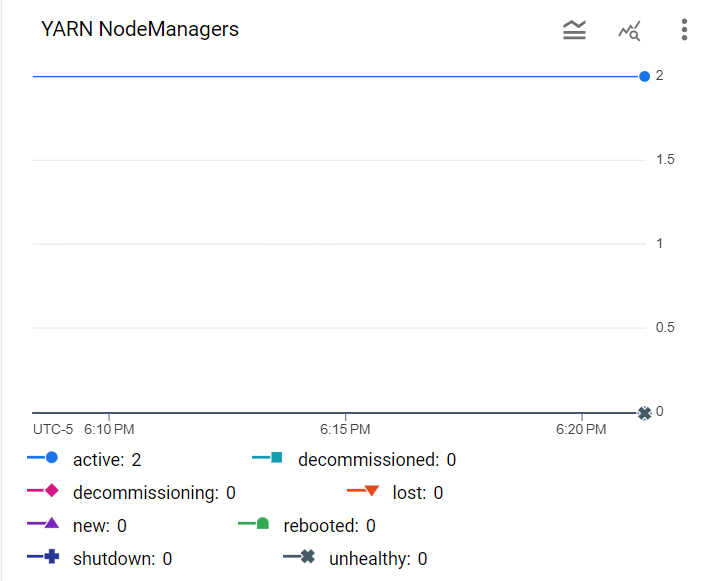
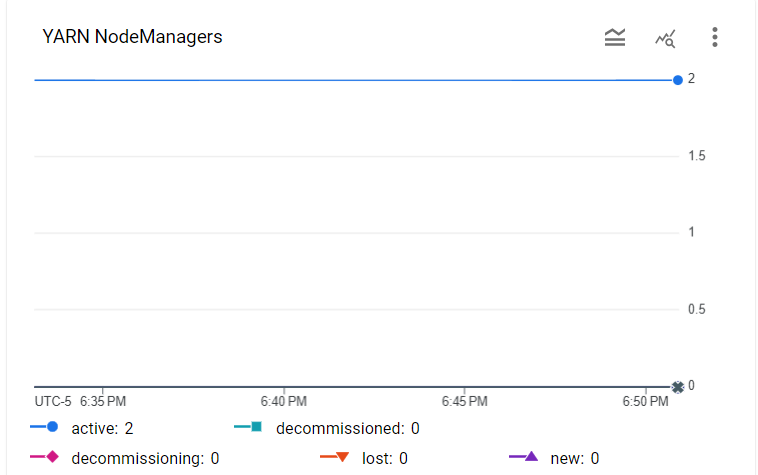
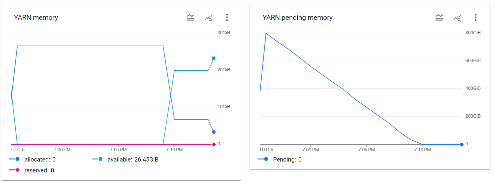
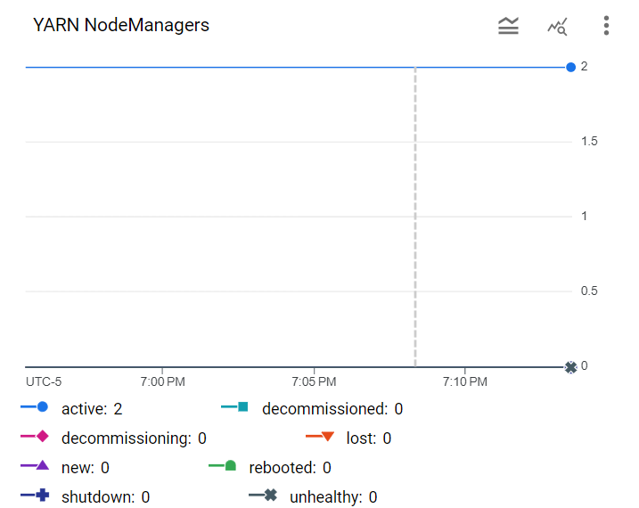

# Please add your team members' names here. 

## Team members' names 

1. Student Name: Cory Chang

   Student UT EID: CCC4497

2. Student Name: Christine Yuan

   Student UT EID: CY6969

3. Student Name: Pranjal Rai

   Student UT EID: PR24977

 ...

##  Course Name: CS378 - Cloud Computing 

##  Unique Number: 51515
    


# Add your Project REPORT HERE 

## Task 1 Output:

```
1    116055
2    89526
3    69277
4    54444
5    42140
6    36306
7    67436
8    108479
9    127918
10    130800
11    127126
12    131993
13    139394
14    140292
15    147635
16    145712
17    127443
18    149571
19    174809
20    179546
21    168344
22    167194
23    160924
24    142821
```



## Task 2 Output:

```
00AC8ED3B4327BDD4EBBEBCB2BA10A00    1.0
00DC83118CA675B9A2876C35E3398AF5    1.0
0219EB9A4C74AAA118104359E5A5914C    1.0
FE757A29F1129533CD6D4A0EC6034106    1.0
FF96A951C04FBCEDE5BCB473CF5CBDBF    1.0
```



## Task 3 Output:

```
FD2AE1C5F9F5FBE73A6D6D3D33270571    4095.0
A7C9E60EEE31E4ADC387392D37CD06B8    1260.0
D8E90D724DBD98495C1F41D125ED029A    630.0
E9DA1D289A7E321CC179C51C0C526A73    231.3
74071A673307CA7459BCF75FBD024E09    210.0
95A921A9908727D4DC03B5D25A4B0F62    210.0
42AB6BEE456B102C1CF8D9D8E71E845A    191.54999
28EAF0C54680C6998F0F2196F2DA2E21    180.0
FA587EC2731AAB9F2952622E89088D4B    180.0
E79402C516CEF1A6BB6F526A142597D4    144.54546
```



## Cloud Setup:


# Project Template

# Running on Laptop     ####

Prerequisite:

- Maven 3

- JDK 1.6 or higher

- (If working with eclipse) Eclipse with m2eclipse plugin installed


The java main class is:

edu.cs.utexas.HadoopEx.WordCount 

Input file:  Book-Tiny.txt  

Specify your own Output directory like 

# Running:


## Create a JAR Using Maven 

To compile the project and create a single jar file with all dependencies: 
	
```	mvn clean package ```


## Run your application
Inside your shell with Hadoop

Running as Java Application:

```java -jar target/MapReduce-WordCount-example-0.1-SNAPSHOT-jar-with-dependencies.jar SOME-Text-Fiel.txt  output``` 

Or has hadoop application

```hadoop jar your-hadoop-application.jar edu.cs.utexas.HadoopEx.WordCount arg0 arg1 ... ```


## Create a single JAR File from eclipse


Create a single gar file with eclipse 

*  File export -> export  -> export as binary ->  "Extract generated libraries into generated JAR"
